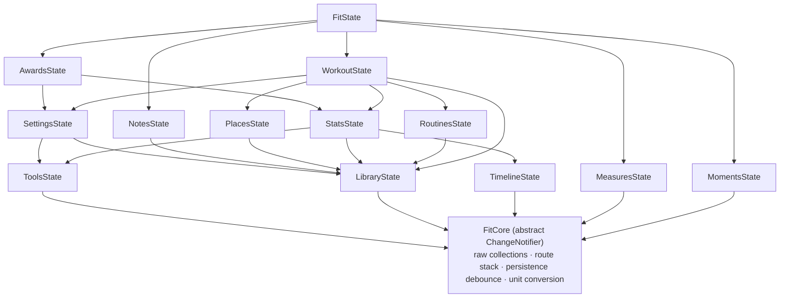
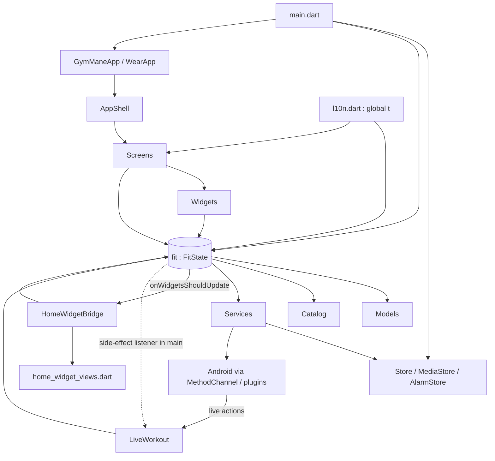

# ARCHITECTURE.md — GymMane

Technical structure of the current implementation (commit `9af217e`, v1.3.0+4). Product context:
[PROJECT_CONTEXT.md](PROJECT_CONTEXT.md). Behaviour per feature: [FEATURES.md](FEATURES.md). Persistence
details: [DATA_MODEL.md](DATA_MODEL.md). Rules: [DEVELOPMENT_GUIDELINES.md](DEVELOPMENT_GUIDELINES.md).

---

## 1. Architecture Overview

GymMane is a **single-process Flutter app with one global mutable state object** and no backend.
It is *not* Clean Architecture, MVVM, BLoC, Provider or Riverpod. The real shape is:

```
Screens / widgets  ──read & call──▶  fit (FitState singleton, a ChangeNotifier)
                                          │  (business rules + state live together, split into mixins)
                                          ├──▶ models (plain classes with toJson/fromJson)
                                          ├──▶ services (storage, alarms, import/export, native bridges)
                                          └──▶ catalog (static const exercise DB, templates, SVG paths)
```

Key characteristics (all verified):

| Trait | Detail |
|---|---|
| State container | `final fit = FitState();` at the bottom of `lib/state/fit_state.dart`; imported everywhere. Widgets call `fit.someMethod()` and rebuild via `AnimatedBuilder(animation: fit)` / `ListenableBuilder`. |
| Layering | Weak: UI → `fit` → services/models. There is **no repository layer**; `FitState` reads/writes `Store` (SharedPreferences) and `MediaStore` (files) directly. |
| Business logic location | Inside the `FitState` mixins in `lib/state/`. Pure helpers (CSV/plan parsing, exercise matching, SQLite reading) live in `lib/services/`. |
| Persistence trigger | Mutating methods call `_persist()` (400 ms debounce) or `persistNow()`; the *whole* state is re-serialised each time. |
| Navigation | String route inside `FitState`, not `Navigator` routes. |
| Platform code | Kotlin: MainActivity channels, live notification, 5 widget providers. |
| Second UI | `lib/wear/` reuses the same `fit` on watches. |

## 2. Repository Structure

```
GymMane/
├── pubspec.yaml / pubspec.lock     dependencies; version 1.3.0+4; assets, shaders, Manrope fonts; launcher-icon config
├── analysis_options.yaml           flutter_lints + prefer_single_quotes; excludes generated l10n; formatter page_width 110
├── l10n.yaml                       gen-l10n config (arb-dir lib/l10n, template app_en.arb, output committed)
├── crowdin.yml                     Crowdin mapping (zh-TW → zh_Hant); see PROJECT_CONTEXT §8.3
├── README.md / CONTRIBUTING.md / TRANSLATING.md / CREDITS.md / LICENSE   (+ docs/readme/README.{es,it,zh}.md)
├── .agents/ .claude/ skills-lock.json   local AI-agent tooling (installed skills) — git-ignored, not part of the app
├── .github/
│   ├── workflows/build-apk.yml     PR: analyze+test+build; manual dispatch: signed reproducible release
│   ├── ISSUE_TEMPLATE/*, FUNDING.yml
├── fastlane/metadata/android/en-US/  F-Droid store text, screenshots, changelogs (<versionCode>{1,2,3}.txt)
├── docs/                           README screenshots, store badges, crypto icons (no technical docs)
├── assets/
│   ├── art/       302 *.txt files: 3 lines each = 3 SVG-path frames (512×512) of an exercise animation
│   ├── badges/    20 medals × {name.webp, name_off.webp} (+ spin/ variants referenced by medalSpinAsset)
│   ├── audio/rest_over.wav         default rest-over sound
│   ├── fonts/     Manrope (static 400/500/600/700/800, generated from the OFL variable font) + OFL
│   ├── icon/, img/ (default profile/banner, runner.png), shaders/ (medal.frag, edge_fade.frag)
├── android/                        Gradle Kotlin DSL; app/src/main/{AndroidManifest.xml,kotlin,res}
│   └── app/src/main/kotlin/com/gymmane/app/
│       ├── MainActivity.kt         method channels (see §12)
│       ├── LiveNotifier.kt         ongoing "live workout" notification + LiveActionReceiver
│       ├── ThemedWidget.kt, {Today,Week,Heatmap,Stats,Body}WidgetProvider.kt   home-screen widgets
├── lib/
│   ├── main.dart                   bootstrap (see §3)
│   ├── app/
│   │   ├── gymmane_app.dart        MaterialApp (themes, locale, text-scale clamp, button-nav scrim)
│   │   └── app_shell.dart          route→screen switch, custom nav bar, parked-session pill, award celebration, incoming-share handling, back handling
│   ├── state/                      ★ all app state + business logic
│   │   ├── fit_state.dart          class FitState (mixes everything), load/save/reset/backup-apply, plan import/export, template apply, back handling, `fit` singleton
│   │   ├── fit_core.dart           abstract FitCore: raw collections, route stack, persistence debounce, unit conversion, helpers (fmt, dayKey, daysBetween, heat levels)
│   │   ├── workout_state.dart      live session engine (start, sets, rest timer, holds, supersets, finish, resume)
│   │   ├── stats_state.dart        all derived statistics, PRs, streak, recovery, habit detection, focus suggestion
│   │   ├── routines_state.dart     routines, weekly plan, planned sets, chains
│   │   ├── library_state.dart      exercise search/filter/favourites/archive/custom/media/modes
│   │   ├── settings_state.dart     theme, language, units, rest, alarm, profile, background, reminders
│   │   ├── places_state.dart       equipment profiles, plate stock, gear filtering
│   │   ├── notes_state.dart, moments_state.dart, measures_state.dart, timeline_state.dart
│   │   ├── awards_state.dart       AwardId enum + earn logic
│   │   └── tools_state.dart        calculator inputs + formulas
│   ├── models/                     plain data classes (exercise, workout, live_session, profile, note, place, measure, progress_shot)
│   ├── catalog/
│   │   ├── exercise_catalog.dart   kExercises (552), filters, kNeedsKit, kWarmupIds, kCardioExtras, kExerciseModes, kToolMeta   (~358 KB, generated-style data file)
│   │   ├── exercise_aliases.dart   alias names from other apps → canonical name
│   │   ├── opengym_ids.dart        openGym id → local exercise id
│   │   ├── program_templates.dart  8 ProgramTemplates (names, sets, weekdays)
│   │   ├── body_svg.dart           SVG path data for the body map (fills, hit areas)
│   │   ├── awards.dart / medal_look.dart   award names/asset paths, medal metal/icon/gem look
│   ├── services/
│   │   ├── local_store.dart        `Store`: SharedPreferences JSON blob, JSON/CSV export
│   │   ├── media_store.dart        `MediaStore`: files in <documents>/exercise_media
│   │   ├── alarm_store.dart        `AlarmStore`: single custom alarm sound file
│   │   ├── backup_zip.dart         buildBackupZip / restoreBackupZip
│   │   ├── workout_import.dart     CSV+openGym-JSON importers (Hevy, Strong, Lyfta, Fitbod, FitNotes CSV, GymMane CSV, generic, weights)
│   │   ├── fitnotes_backup.dart + sqlite_reader.dart   FitNotes .fitnotes SQLite importer
│   │   ├── plan_share.dart         tolerant plan-JSON/CSV parser (PlanRoutine/PlanItem/PlanSet)
│   │   ├── exercise_match.dart     name normalisation, search filter, fuzzy matching, muscle guessing
│   │   ├── rest_alarm.dart, train_reminder.dart, progress_reminder.dart, beeper.dart   notifications/sound
│   │   ├── live_workout.dart       pushes session state to the Android live notification (iOS branch present)
│   │   ├── home_widget_bridge.dart renders widget PNGs and triggers provider updates
│   │   ├── incoming_share.dart, gallery.dart, device_kind.dart, screen_awake.dart   thin MethodChannel wrappers
│   ├── screens/                    one file per screen (+ bottom-sheet flows): home, train, session, progress, exercises, exercise_detail, routines, routine_edit, settings (=Preferences), profile (=route 'settings'), onboarding, measures, places, notes, note_edit, moments, timeline, compare, awards, tools, tool_detail, ai_plan, plan_import_sheet, start_sheet, share_sheet, sticker_screen, about
│   ├── widgets/                    shared UI kit (ui_kit, glass, dialogs, charts, body_map, muscle_radar, exercise_art/media/preview, medal, celebration, rulers/pickers, home_widget_views, wear timer_panel, …)
│   ├── theme/                      app_colors.dart (GymColors ThemeExtension, AA-checked; + success/progress/streak), app_theme.dart (AppTheme.f/s/d text styles), tokens.dart (GymSpace / GymRadius / GymText scales)
│   ├── l10n/                       app_*.arb (17), generated app_localizations*.dart (17 locales + base), l10n.dart (globals `t`, `appLanguage`, extension GymL10n), catalog_{es,it,zh}.dart (exercise names/steps)
│   └── wear/                       wear_app.dart, wear_shell.dart (Wear OS UI)
└── test/                           55 test files; see DEVELOPMENT_GUIDELINES §13
```

Naming quirks that trip agents:

| Name | Actually is |
|---|---|
| `lib/models/live_session.dart` | defines `WorkoutSession`, `SessionExercise`, `SessionSet` (the *in-progress* workout) |
| `lib/models/workout.dart` | defines `SetKind`, `LoggedSet`, `LoggedExercise`, `LoggedSession`, `BodyweightEntry`, `PlannedSet`, `Routine`, `PrKind`, `PersonalRecord` |
| Route `'settings'` | renders `ProfileScreen` (bottom-nav tab "Profile") |
| Route `'preferences'` | renders `SettingsScreen` (opened with the gear on the profile) |
| `Moment` | class lives in `lib/state/moments_state.dart`, not in `models/` |
| `BodyWindow` typedef, `Muscle`, `ToolMeta` | in `timeline_state.dart`, `models/exercise.dart`, `models/exercise.dart` |
| `lib/widgets/timer_panel.dart` | shared rest-timer widget used by phone and Wear |

## 3. Application Entry Point

`lib/main.dart › main()` (order matters):

1. `WidgetsFlutterBinding.ensureInitialized()`; edge-to-edge system UI with transparent bars.
2. `initializeDateFormatting()`.
3. `Store.instance.init()` → `MediaStore.init()` → `AlarmStore.init()` (each swallows errors; a `null` directory disables that store).
4. `fit.loadFromStore()` — synchronous JSON→objects hydration, now migrated (`migrateDocument`) and parsed defensively (§14 R1). Adopts device language if none stored; runs legacy conversions; restores a live session if one was persisted (`_restoreLiveSession` → route forced to `session`).
5. `RestAlarm.instance.init()` (timezone init, notification plugin, audio player).
6. `fit.syncPhotoReminder()`, `fit.syncTrainReminder()`.
7. `DeviceKind.isWatch()` (MethodChannel `gymmane/device`). `fit.addListener(_sessionSideEffects)` — on every notify: `LiveWorkout.sync()` (phone only) and `ScreenAwake.keepOn(...)` when a non-manual session is active.
8. If watch → `runApp(WearApp())`. Otherwise `fit.onWidgetsShouldUpdate = HomeWidgetBridge.update; runApp(GymManeApp())` and one post-frame widget refresh.

`GymManeApp` → `MaterialApp(home: AppShell)`, themes `AppTheme.light/dark`, `themeMode: fit.themeMode`, `locale: fit.locale`, text scale clamped to 2.0 (tight widgets clamp themselves further, e.g. the session clock at 1.4 and the rest-timer digits at 1.3), and a `_ButtonNavScrim` that paints the bg colour under 3-button navigation bars.

`AppShell.build`: if `!fit.onboarded` → `OnboardingScreen`; otherwise the full shell (§4/§7).

## 4. Navigation

Implemented in `FitCore` (`lib/state/fit_core.dart`) and `AppShell`:

- `String route` + private `_routeStack`. APIs: `pushRoute`, `popRoute(fallback:)`, `resetRoute`, `_setRoute(reset:)`, tab switches `goHome/goProgress/goExercises/goSettings` (clear the stack).
- `showNav` is true only for the four tab routes `home, progress, exercises, settings`.
- `AppShell._screen()` maps route → widget (source of truth for valid routes):

| Route | Screen | Notes |
|---|---|---|
| `home` (default) | `HomeScreen` | tab 1 |
| `progress` | `ProgressScreen` | tab 2 |
| `exercises` | `ExercisesScreen` | tab 3 |
| `settings` | `ProfileScreen` | tab 4 |
| `preferences` | `SettingsScreen` | pushed from profile |
| `personalize` | `OnboardingScreen(personalize: true)` | opt-in questionnaire for existing users; back handled through `fit.personalizeBack` |
| `train` | `TrainScreen` | body-map picker (`trainStep`: `select` → `review`) |
| `session` | `SessionScreen` | live/finished workout |
| `exercise-detail` | `ExerciseDetailScreen` | uses `activeExerciseId` |
| `routines`, `routine-edit` (`activeRoutineId`), `ai-plan` | routine screens | |
| `tools`, `tools-detail` (`activeToolId`) | calculators | |
| `measures`, `timeline`, `compare` | body tracking | |
| `notes`, `note-edit` | journal | `note-edit` keyed by `editingNoteId` |
| `places`, `moments`, `awards`, `about` | misc | |

- **Navigation map and decisions (GM-17).** The structure stays as is — 4 tabs plus the centre ▶ action — because no usability problem was shown and the Kaizan brief forbids changing navigation for visual reasons. Where things live:
  - **Home** (tab): today's routine and the primary action, week strip, stats; entry cards to *Routines*, *Tools* (calculators) and *Notes* (journal); *Snapshots*; the personalize nudge.
  - **Progress** (tab): records, activity heat-map, body measures (`measures`) and the body timeline (`timeline`/`compare`).
  - **Exercises** (tab): library, filters, favourites, exercise detail; *Places* is reached from here and from Preferences.
  - **Profile** (tab, route `settings`): identity, awards, snapshots, and the gear button → **Preferences** (route `preferences`, `SettingsScreen`) → data, widgets, support, *About*.
  - ▶ (centre): start today's planned routine, resume a parked session, or open the body-map picker (`train`).
  - Route names `settings` (= Profile) and `preferences` (= Settings screen) are historically swapped; they are internal only (never persisted or shown), so they are documented here rather than renamed — a rename would touch back-handling in every mixin for no user-visible gain.
  - Nav bar: labels are shown in one sentence-case style in every language (`titleCase`), 10.5 sp, and `test/nav_labels_test.dart` holds them to a 70 % maximum shrink at 1.15× text in all locales (Arabic's profile label is "حسابي" for that reason). The active tab uses the brand accent (`ember`) for icon and label.
  - Glass nav: **kept** (`GlassSurface` is on the GM-93 allowlist because the bar floats over scrolling content and the blur protects legibility); the drag/long-press pill slider stays as a secondary gesture, but its overshoot curve and 460 ms glide were removed (GM-19). Revisit only if a device test shows the blur costs frames (GM-83).
  - `test/navigation_map_test.dart` fails if a screen in `AppShell._screen()` has no way in, or if a route is missing from the table above.
- Back button: `PopScope(canPop:false)` in `AppShell` → if session locked: haptic only; active session: confirm discard; completed session: `saveAndExit`; else `fit.handleBack()` (a `switch` on route with per-route back functions) or `SystemNavigator.pop()`.
- Screen transition: `ScreenSwitcher` (`widgets/screen_switcher.dart`) with the budget from `theme/motion.dart` — 160 ms crossfade for tab↔tab, 240 ms fade + small vertical shift for depth changes, 100 ms fade under reduced motion; no blur/scale. Both `_NavBarState._routes` and `handleBack` must stay in sync with the route list.
- Sheets/dialogs use Flutter's `Navigator` through helpers (`showAppSheet`, `showAppDialog`, `askConfirm/askText/askNumber` in `lib/widgets/`). They are not part of `fit.route`. Three full-screen overlays are also pushed with `Navigator.of(context).push(PageRouteBuilder…)` and therefore sit outside `fit.route`: the sticker editor (`showStickerEditor`), the snapshot viewer (`moments_screen.dart`) and the note-media viewer (`note_kit.dart`).
- Deep links: Android intent filters accept `VIEW` of `content:`/`file:` JSON and `SEND` of `application/json`/`text/plain`; `MainActivity` reads the text (≤ 2 MB) and passes it through `gymmane/incoming` to `AppShell`, which opens `showPlanImportSheet` (only when onboarded and no active session).

## 5. State Management

`FitState extends FitCore with ToolsState, LibraryState, SettingsState, NotesState, PlacesState, MeasuresState, MomentsState, TimelineState, StatsState, AwardsState, RoutinesState, WorkoutState`.
All are `part of 'fit_state.dart'`, so private (`_`) members are shared across mixins in the library.


(arrow = "declares `on`"; `FitState` mixes in all twelve.)

Design rules that follow from the code:

- **Extension points are stubbed in `FitCore` and overridden by later mixins** to avoid circular mixin constraints: `syncTrainReminder()` (overridden in `FitState`), `refreshAwards()` (`AwardsState`), `plateStockKg`/`placeBarKg` (`PlacesState`), `fitsHere()` (`LibraryState` → `PlacesState`), `setEquipmentFilter/exercisesMatching/clearExFilters` (`LibraryState` → `PlacesState`).
- **Raw data lives in `FitCore`** (`sessions`, `bodyweight`, `notes`, `measures`, `shots`, `checkins`, `routines`, `weeklyPlan`, `planExtras`, `customExercises`, `places`, `exerciseMedia`, `exerciseRest`, `progressStep`, `autoWarmup`, `repsOnly*`, `noSuggest`, `archived`, `videoMarks`, `modeOverride`, `favorites`, `profile`, `units`, `weekStartDay`). Mixins own UI/session state and settings fields.
- **Notification model**: every mutator ends with `notifyListeners()`; there are no granular selectors. During a live session a 1-second `Timer.periodic` also calls `notifyListeners()` (whole-tree rebuild through `AnimatedBuilder`s).
- **Persistence coupling**: `_persist()` is a no-op while `_loading` is true (set during `loadFromStore` and `applyBackup`).
- **Transient session UI state** (`trainStep`, `sessionPicks`, hold timers, `countdownUntil`, `sessionLocked`, filters, note drafts, compare selection) is *not* persisted; only the live workout, its elapsed/paused/start markers, and settings are.
- **Global localisation object**: `t` (`AppLocalizations`) and `appLanguage` are top-level mutable globals in `lib/l10n/l10n.dart`, updated by `setAppLanguage`. `FitState` and services read `t` directly (e.g. `RestAlarm` builds notification text from `t`).

### Session engine (WorkoutState) — timers

| Timer | Purpose |
|---|---|
| `_sessionTimer` (1 s) | UI tick; elapsed = `_elapsedBefore + now - _runningSince` |
| `_restTimer` (1 s) | counts down `session.restEndsAt`; on 0 → `restDoneTick++` + `RestAlarm.fireNow()` |
| `_advanceTimer` | auto-advance to next exercise (900 ms; 3500 ms if waiting for RPE; 1500 ms before auto-finish) |
| `_holdTimer` (100 ms) | timed-set countdown: 5 s lead-in + `sec`, with `Beeper` ticks |
| `RestAlarm.schedule` | OS-level scheduled notification (`zonedSchedule`, `AndroidScheduleMode.alarmClock`) so the rest ends even when backgrounded |
| `AppShell` lifecycle | on `resumed` → `fit.syncRest()` re-arms Dart timers from the persisted `restEndsAt` |

## 6. Feature Architecture

Features are **not** directory-modularised. A feature = (a mixin in `lib/state/`) + (model(s) in `lib/models/`) + (screen file(s) in `lib/screens/`) + (widgets) + (ARB keys) + (route). Mapping:

| Feature | State | Model | Screen(s) | Services |
|---|---|---|---|---|
| Live workout / train | `workout_state.dart` | `live_session.dart`, `workout.dart` | `train_screen`, `session_screen`, `start_sheet` | `rest_alarm`, `live_workout`, `beeper` |
| Statistics / progress | `stats_state.dart` | `workout.dart` | `progress_screen`, `home_screen` | `home_widget_bridge` |
| Exercise library | `library_state.dart`, `places_state.dart` | `exercise.dart`, `place.dart` | `exercises_screen`, `exercise_detail_screen`, `places_screen` | `exercise_match`, `media_store` |
| Routines & plans | `routines_state.dart`, `fit_state.dart` (plan import/export, templates) | `workout.dart (Routine, PlannedSet)` | `routines_screen`, `routine_edit_screen`, `ai_plan_screen`, `plan_import_sheet` | `plan_share` |
| Body tracking | `measures_state`, `timeline_state`, `stats_state` | `measure`, `progress_shot` | `measures_screen`, `timeline_screen`, `compare_screen` | `media_store`, `progress_reminder` |
| Journal / snapshots | `notes_state`, `moments_state` | `note.dart`, `Moment` | `notes_screen`, `note_edit_screen`, `moments_screen` | `media_store` |
| Awards | `awards_state` | — | `awards_screen`, `award_celebration` widget | catalog `awards.dart`, `medal_look.dart` |
| Tools | `tools_state` | — | `tools_screen`, `tool_detail_screen` | — |
| Settings / profile | `settings_state` | `profile.dart` | `settings_screen`, `profile_screen`, `onboarding_screen`, `about_screen` | `alarm_store`, `train_reminder` |
| Backup / import | `fit_state.dart` (`applyBackup`, `import*`) | — | `settings_screen` | `backup_zip`, `workout_import`, `fitnotes_backup`, `sqlite_reader`, `local_store` |
| Sharing | — | — | `sticker_screen`, `share_sheet` | `gallery`, `share_plus` |
| Wear OS | same `fit` | — | `lib/wear/wear_shell.dart` | `screen_awake`, rotary channel |

## 7. UI Architecture

- **Shell** (`app_shell.dart`): stacked layers — solid bg, `AppBackground` (pattern `none|dots|grid|photo` with dim), `Scaffold` (current screen), top/bottom `EdgeBlur` fades, custom bottom **liquid nav bar** (`_NavBar`: 4 tabs + centre play FAB; drag/long-press slides a `_LiquidPill`), parked-session pill, start countdown overlay, award celebration overlay. The nav bar is forced LTR.
- **Large screens are split with `part` files** (GM-65): `session_screen.dart` (435 lines: `SessionScreen`, `build`, `_active`, header, progress strip) owns `session/` — `set_rows`, `live_bar`, `kind_sheet`, `controls`, `summary` (private extensions on `SessionScreen`, grouped by feature) and `sheets`, `stage` (sheets, `_ExerciseStage`, `_LockGuard`, `_HoldToUnlock`, `_Celebrate`). `progress_screen.dart` (490 lines) owns `progress/` — `body_cards`, `muscle_map`, `strength_card`, `day_sheet`, `log_sheets`, `track_painter`. Each part is the same Dart library, so private names, public entry points (`showDaySheet`, `showEditLoggedSheet`, `showHeatToneSheet`, `showAddToSessionSheet`, `showSessionOverview`, `showExerciseHistorySheet`) and imports are unchanged. New code for these screens goes into the matching part file; no file in `lib/screens/session*` or `progress*` should exceed 1,000 lines.
- **Screens** are large `StatelessWidget`/`StatefulWidget`s that read `fit.*` directly and contain layout + private sub-widgets (`_Card`, `_Sheet` classes in the same file). Business calls go to `fit`. Files > 40 KB: `session_screen` (73 KB), `progress_screen` (65 KB), `settings_screen` (58 KB), `routine_edit_screen` (42 KB), `wear_shell` (41 KB).
- **Shared kit** (`lib/widgets/`): `ui_kit.dart` (SoftCard, SearchField, TinySwitch, Pressable, GhostButton, SheetHandle/Title, OptionGroup, RoundBtn, ScreenHeader/Title, Kicker, StepperControl, SegToggle, Pill, PrimaryButton, string helpers `sentenceCase/titleCase`), `glass.dart` (GlassSurface, EdgeBlur, `showAppSheet`, `showAppDialog`), `dialogs.dart`, `charts.dart` (GoalRing, VolumeChart, Sparkline, TrendChart, Heatmap, SplitBars, Emblem), `ruler_picker.dart`/`body_rulers.dart`, `body_map.dart` + `muscle_radar.dart`, `exercise_art.dart` (animated vector frames), `exercise_media.dart`/`exercise_preview.dart` (user media, video step marks), `medal.dart`/`medal_shelf.dart`/`award_celebration.dart`, `entrance.dart` (`RiseScope`/`Rise` staggered entrance, once per day per screen using `Store.note`), `home_widget_views.dart`, `share_cards.dart`, `timer_panel.dart`, `stopwatch_card.dart`, `routine_folder.dart`, `note_kit.dart`, `profile_avatar.dart`, `photo_source_sheet.dart`, `set_kind.dart`, `start_countdown.dart`, `svg_icon.dart` (`svgPath` cache, `SvgPathIcon`), `shimmer.dart`, `rolling_text.dart`, `liquid_notch.dart` (`showNotchToast`).
- **Theme**: `GymColors` `ThemeExtension` (tokens: `pageBg, bg, bgRaised, bgRaised2, border, navBg, text/secondary/tertiary, ember(+Deep/Soft/Shadow, onEmber), accent(+Soft), brass, sage(+Soft), mutedFill, heatEmpty, info, warn, danger`) accessed as `context.gc`. `AppTheme.f/s/d(size, weight, color…)` return `TextStyle`s (all Manrope). Dark default (`themePref = 'dark'`; also `light`, `system`). Palette is the Kaizan palette (sumi/paper neutrals, vermilion `ember` accent) — see DEVELOPMENT_GUIDELINES §9; WCAG AA is enforced by `test/contrast_test.dart`. Heat-map colour ramps `ember|green|blue|mono` in `body_map.dart`.
- **Layout conventions**: hard-coded pixel sizes in screens (no spacing tokens); `Pressable` for tappable cards; sheets via `showAppSheet`; toasts via `showNotchToast`.
- **RTL**: Arabic (and, once registered, Persian) work through Flutter's locale directionality; the nav bar overrides to LTR.
- **Accessibility** (GM-20): `Semantics` on every custom control; `MinTarget` (ui_kit) grows a tappable box to 48 dp while the visual keeps its size and is applied inside `Pressable`-style widgets (`Pill`, `RoundAction`, `SegToggle`, `StepperControl`, section headers, list rows); charts, goal ring and heat-map expose one spoken summary (`goalRingLabel`, `heatmapLabel`, `trendChartLabel`) and the body map exposes each muscle as a selectable button through `CustomPainter.semanticsBuilder` plus a `bodyMapLabel`/`bodyMapNone` summary; `RestAnnouncer` politely announces the rest timer (start, 10 s left, over). `test/a11y_test.dart` audits tap targets on Home, Exercises, Progress, Profile, Preferences, Train, Routines, Tools, Notes, Measures, onboarding and a live session (everything ≥ 48 dp, except dense rows such as the 7-day strip and the +/- steppers which are ≥ 28 dp wide × 48 dp tall; body-map regions are drawn shapes).

## 8. Business Logic

All in `lib/state/*` (see per-rule detail in [FEATURES.md](FEATURES.md)). Highest-value locations:

| Rule | Location |
|---|---|
| Set/volume/1RM/PR maths | `LoggedSet.volume/oneRm`, `rpePercent` (`models/workout.dart`); `_record`, `personalRecords`, `prsThisWeek` (`stats_state.dart`) |
| Suggested next load, progression bump, warm-up sets | `nextTarget`, `_progressBump`, `_workingOpeners`, `_warmupFor` (`workout_state.dart`) |
| Rest length | `restFor` (`settings_state.dart`) |
| Streak / weekly goal / check-ins | `currentStreak`, `isDayDone`, `goalPct` (`stats_state.dart`) |
| Muscle heat, radar targets, recovery model | `muscleSetsOver`, `muscleHeat*`, `muscleFatigue`, `muscleRecovery` (`stats_state.dart`) |
| Daily focus suggestion / habit detection | `suggestedFocus`, `usualWeekdays`, `usualStartMinute` |
| Unit conversion | `FitCore` (`toDisplayWeight`, `fromDisplayWeight`, `toDisplayKm`), `MeasuresState` |
| Plates / 1RM / BMI / TDEE / body-fat formulas | `tools_state.dart` |
| Award thresholds | `awards_state.dart` (`awardGoal`, `awardValue`) |
| Import matching | `services/exercise_match.dart`, `FitState.importParsedSessions` |
| Plan parsing/apply | `services/plan_share.dart`, `FitState.applyPlan` |

## 9. Service Layer

| Service | Kind | Role / notes |
|---|---|---|
| `Store` | singleton | Only reader/writer of the `gymmane_v1` blob and `gm_*` keys; swallows all errors (a failed `save` is silent). |
| `MediaStore` | static | Files under `<documents>/exercise_media`; names `<owner>-<microsecondsSinceEpoch>-<seq>.<ext>`; `clearAll()` deletes every file (used by restore + reset). `@visibleForTesting set directory`. |
| `AlarmStore` | static | One file `alarm-<ms>.<ext>` in `<documents>/alarm`; `importSound` clears previous. Max sound length 15 s (`maxDuration`; enforced in UI via `RestAlarm.probeDuration`). |
| `RestAlarm` | singleton | Rest notification (3 channel variants by `style`: `loud`/`quiet`/`vibrate`), `fireNow` (in-app sound/haptics + notification only when app not resumed), permission asking, custom sound preview. Generation counter prevents late schedules from resurrecting after cancel. |
| `TrainReminder` | singleton | Schedules up to 14 notifications (ids 1010–1023) over a 28-day horizon at the chosen minute; skips today if already trained; uses exact alarms if allowed. |
| `ProgressReminder` | singleton | One notification (id 1002) at 10:00 on the next photo-due day. |
| `Beeper` | singleton | Generates two WAV tones into the temp dir at first use; plays via `audioplayers`. |
| `LiveWorkout` | static | Diffs the session into a key string and pushes to `gymmane/live` (Android) or `gymmane/live_activity` (iOS branch); receives action callbacks (`done, pause, add, skip, next`) and calls back into `fit`. Serialises calls with `_busy/_dirty`. |
| `HomeWidgetBridge` | static | Renders 9 Flutter widget images per theme (day and night variants; `heatmap`, `stats`, `body`, 4× `today*`, 2× `week*`) via `HomeWidget.renderFlutterWidget`, writes plan/week metadata strings, calls `updateWidget` for the five providers. |
| `backup_zip.dart` | functions | ZIP build/restore (see [DATA_MODEL.md](DATA_MODEL.md) §8). |
| `workout_import.dart` etc. | pure functions | See [DATA_MODEL.md](DATA_MODEL.md) §7. |
| `exercise_match.dart` | pure functions | Tokenise/normalise names, synonyms (`db→dumbbell`, `ohp→overhead press`…), alias index, `matchExercise`, `guessMuscle`, `exerciseSearch`. |
| `IncomingShare`, `gallery.dart`, `DeviceKind`, `ScreenAwake` | MethodChannel wrappers | Channels: `gymmane/incoming`, `gymmane/gallery`, `gymmane/device`, `gymmane/screen`. |

## 10. Repository / Data Access Layer

There is **no repository abstraction**. Data access is:

1. `FitState.toJson()` / `loadFromStore()` / `applyBackup()` — object graph ⇄ one `Map<String,dynamic>`.
2. `Store.save/load` — map ⇄ SharedPreferences string.
3. `MediaStore` / `AlarmStore` — file bytes for user media.
4. `backup_zip.dart` — bundles (1) with (3).

Consequence: adding a persisted field means editing **four** places in `fit_state.dart`/models (`toJson`, `loadFromStore`, `applyBackup`, `resetAllData`) — see [DATA_MODEL.md](DATA_MODEL.md) §12.

## 11. Dependency Flow



Notable cross-dependencies (potential regression paths):

- `state/` imports `services/` **and** `services/` imports `state/` (`backup_zip.dart`, `live_workout.dart`, `home_widget_bridge.dart` all import `fit_state.dart`). Circular by design; keep the services that touch `fit` free of import cycles with widgets.
- `models/exercise.dart` imports `l10n.dart` (uses global `t` in `exerciseName`, `muscleLabel`).
- `services/live_workout.dart` imports `widgets/ui_kit.dart` (for `titleCase`).
- `services/home_widget_bridge.dart` imports `widgets/home_widget_views.dart` and `theme/`.

## 12. Platform Architecture

**Android manifest** (`android/app/src/main/AndroidManifest.xml`): permissions `POST_NOTIFICATIONS`, `POST_PROMOTED_NOTIFICATIONS`, `USE_EXACT_ALARM`, `SCHEDULE_EXACT_ALARM`, `VIBRATE`, `WRITE_EXTERNAL_STORAGE` (≤ API 28), `USE_FULL_SCREEN_INTENT`, `RECEIVE_BOOT_COMPLETED`, `WAKE_LOCK`; `ACCESS_NETWORK_STATE` removed; **no `INTERNET`** (only in `src/debug`). Declares optional `hardware.type.watch` and no-touchscreen features + `com.google.android.wearable.standalone=true`. Activity is `singleTop`, `taskAffinity=""`.

**Method channels** (`MainActivity.kt`):

| Channel | Methods | Dart side |
|---|---|---|
| `gymmane/haptics` | `buzz` | `rest_alarm.dart` |
| `gymmane/incoming` | `take`; native→Dart `incoming` | `incoming_share.dart` |
| `gymmane/gallery` | `savePng` (MediaStore Q+, legacy path otherwise) | `gallery.dart` |
| `gymmane/screen` | `keepOn`, `dim` | `screen_awake.dart` |
| `gymmane/live` | `update`, `end`; native→Dart `action` | `live_workout.dart` |
| `gymmane/device` | `isWatch` | `device_kind.dart` |
| `gymmane/rotary` | native→Dart `scroll` (Wear rotary crown) | `wear_shell.dart` (`WearRotary`) |
| `gymmane/live_activity` | *(iOS only — no native code in repo)* | `live_workout.dart` |

**Live notification** (`LiveNotifier.kt`, id 1003, channel `live_workout_v2`): ongoing `CATEGORY_WORKOUT` notification with action buttons; API 36+ branch uses `Notification.ProgressStyle` with per-exercise segments; older branch uses custom `RemoteViews` (`live_small/live_big.xml`). Actions arrive via `LiveActionReceiver` → `gymmane/live` `action`.

**Widgets**: five `AppWidgetProvider`s (`Today`, `Week`, `Heatmap`, `Stats`, `Body`) read image paths that Dart wrote via `home_widget` (`*_img`, `*_img_night`, plus metadata keys); `layout/` and `layout-night/` XML. `Today`/`Week` reschedule at midnight (`scheduleNewDay`, `TIME_SET`/`TIMEZONE_CHANGED`).

**Build**: Gradle KTS, AGP 8.9.1, Kotlin 2.1.0, Java 17, core-library desugaring; release signing from `android/key.properties` (falls back to debug signing if absent); split ABIs `armeabi-v7a`/`arm64-v8a`/`x86_64` with versionCode override `versionCode*10 + abiCode`; `dependenciesInfo` excluded (F-Droid).

**iOS**: Darwin notification details, app-group id `group.com.gymmane.app`, and `gymmane/live_activity` are referenced in Dart, but no iOS project exists here.

## 13. External Dependencies (why they are used)

See the table in [PROJECT_CONTEXT.md](PROJECT_CONTEXT.md) §4 for the full list. Non-obvious points:

- `flutter_local_notifications 22` is invoked with named parameters (`initialize(settings:)`, `zonedSchedule(id:…)`, `cancel(id:)`) — upgrade carefully.
- `home_widget` is used *only* to render Flutter widgets to PNGs and push key/values; the widgets themselves are native Kotlin layouts showing those images.
- `archive ^4` API (`ZipEncoder().encodeBytes`, `ArchiveFile.noCompress/string`) is used in `backup_zip.dart`; media are stored uncompressed.
- `file_picker ^8` / `image_picker` for imports and photos; no storage permission is requested on modern Android beyond the manifest lines above (system pickers).
- `path_drawing` is the *only* SVG mechanism (no `flutter_svg`): exercise animation frames, body map, and icons are path strings.
- `intl` is used for locale date symbols; `Intl.defaultLocale` is set in `setAppLanguage`.

## 14. Architectural Risks / Technical Debt (observed, not speculative)

| # | Risk | Where | Effect |
|---|---|---|---|
| R1 ✅ *resolved (GM-02)* | `loadFromStore()` now parses per section/per item (`_guard`, `_readAll`, `_mapOf/_listOf`); bad records are skipped and counted in `fit.loadSkipped`, a raw copy is kept under prefs key `gymmane_v1_corrupt`, and `AppShell` shows a one-time notice. Covered by `test/data_safety_test.dart` (incl. a seeded fuzz test). | `fit_state.dart`, `local_store.dart`, `app_shell.dart` | Residual: a skipped record is lost from the working copy (the raw copy is not restorable from the UI). |
| R2 ✅ *resolved (GM-03)* | `applyBackup` now validates (`checkDocument`), migrates, applies with rollback to a pre-apply snapshot, always resets `_loading`, returns `bool`, re-syncs reminders and restores `heatTone`. `restoreBackupZip` no longer clears media first: it writes new files, applies, and only then removes unreferenced files (`MediaStore.retainOnly`); on failure it deletes just the files it wrote. | `fit_state.dart`, `backup_zip.dart`, `schema.dart` | Residual: alarm-sound file is still replaced after a successful apply. |
| R3 | Whole-state re-serialisation: every change re-encodes the entire dataset (sessions, profile photo/banner base64, notes…) into one SharedPreferences string. | `FitCore._persist`, `Store.save` | Cost grows with history; SharedPreferences write failures are swallowed (`Store.save` `catch (_) {}`). |
| R4 ✅ *resolved (GM-05)* | Logged-set edits use `LoggedSet.copyWith`; `addLoggedSet` copies `kind/sec/km` (not RPE). | `models/workout.dart`, `stats_state.dart` | — |
| R5 | `deleteCustomExercise` removes it from routines' `exerciseIds`, favourites, media, mode override, but leaves `r.sets/r.plan/r.chained` entries, `archived`, `exerciseRest`, `progressStep`, `repsOnly*`, `noSuggest`, `videoMarks`, notes with that `exerciseId`, and history sessions. | `library_state.dart` | Orphan keys; history retains name snapshot (intended) but per-exercise settings leak. |
| R6 | Global singletons (`fit`, `t`, `Store.instance`, `RestAlarm.instance`) → tests must reset state manually in `setUp`; no isolation. | throughout `test/` | Test order coupling risk. |
| R7 | Whole-tree rebuilds: `AnimatedBuilder(animation: fit)` at app root and per screen; session view ticks every second. | `gymmane_app.dart`, `app_shell.dart` | Performance sensitivity in large screens (`session_screen`, `progress_screen`). |
| R8 | Very large files (`exercise_catalog.dart` 358 KB, `body_svg.dart` 116 KB, `catalog_*.dart` ~250 KB each, generated l10n) are checked-in data; large screen files mix layout and logic. | `lib/` | Slow diffs/merge conflicts. |
| R9 ✅ *mitigated (GM-01)* | Committed generated l10n can drift from ARBs (it did for `fa`, `pt`, `tr`). `i18n_test` now fails when generated classes miss any ARB key or language. | `lib/l10n`, `test/i18n_test.dart` | Still requires running `flutter gen-l10n` manually. |
| R10 | Unused dependency `cupertino_icons`. | `pubspec.yaml` | Minor. |
| R11 | iOS/Wear code paths cannot be exercised in CI (no iOS project; Wear smoke test removed). | `rest_alarm.dart`, `live_workout.dart`, `wear/` | Regressions undetected. |
| R12 | `resetAllData` does not reset theme, units, language, rest length, alarm style/sound, background pattern/dim/tone, keep-awake, photo interval, body-timeline flag, and does not clear `gm_*` keys or the alarm-sound file. If `bgPattern == 'photo'` the photo file is deleted but the pattern is not reset (rendering fallback not verified). | `fit_state.dart` `resetAllData` | "Delete everything" is not a full factory reset — intentional or not is **Unknown**. |
