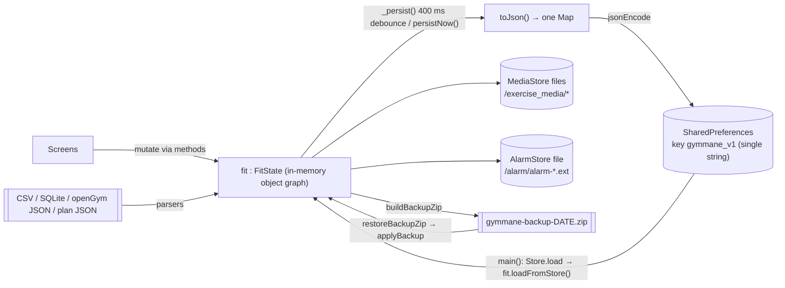
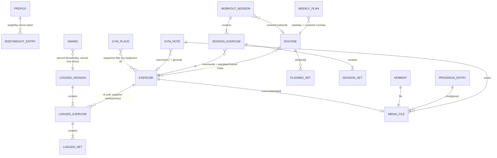

# DATA_MODEL.md — GymMane

Every statement below was read from source (commit `9af217e`, v1.3.0+4). Nothing here is an inferred
schema: there is **no database, no ORM, no migrations framework**. Feature behaviour:
[FEATURES.md](FEATURES.md). Where the code lives: [ARCHITECTURE.md](ARCHITECTURE.md). Rules for changing
data: [DEVELOPMENT_GUIDELINES.md](DEVELOPMENT_GUIDELINES.md) §8. Product context:
[PROJECT_CONTEXT.md](PROJECT_CONTEXT.md).

---

## 1. Data Architecture Overview



Principles observed in code:

- The **entire dataset is one JSON document** rewritten on every change (plus separate media files).
- In-memory model = Dart objects (mutable lists/maps on `FitCore`); JSON keys are 1–3 letter abbreviations.
- References between entities are **soft** (ids/file names stored as strings); nothing enforces referential integrity.
- Weight → kg, distance → km, length → cm, time → seconds, dates → ISO-8601 strings of *local* `DateTime`s (no offset).
- Derived data is not stored (except `awards`).

## 2. Persistence Technology

| Store | Tech | Location / key | Content | Code |
|---|---|---|---|---|
| Main state | `shared_preferences` string | key `gymmane_v1` | everything in §3 except media bytes | `Store` (`lib/services/local_store.dart`) |
| UI once-per-day flags | `shared_preferences` strings | keys `gm_rise_<id>` = `YYYY-M-D` | entrance-animation gating only (**not** in backups, **not** cleared by reset) | `Store.note/setNote`, `widgets/entrance.dart` |
| User media | files | `<applicationDocuments>/exercise_media/<owner>-<µs>-<seq>.<ext>` | exercise photos/GIFs/videos, note media, progress shots, moments, background photo | `MediaStore` |
| Alarm sound | file | `<applicationDocuments>/alarm/alarm-<ms>.<ext>` (only one) | custom rest sound | `AlarmStore` |
| Temp files | files | `getTemporaryDirectory()` | share/export files, `gm_tick.wav`, `gm_go.wav` | screens, `Beeper` |
| Widget images | files managed by `home_widget` | plugin storage + widget shared prefs keys (`heatmap_img`, `stats_img`, `body_img`, `today_*`, `week_*`, `*_night`, `today_stamp`, `today_week`, `week_start`, `week_first`, `week_done`, `week_geo`, `week_ring*`) | rendered PNG paths & metadata | `HomeWidgetBridge` |

`Store.save` swallows all exceptions; `Store.load` returns `{}` if the string is missing, empty, not valid JSON, or not a JSON object.
`android:allowBackup="false"` — nothing is included in Android auto-backup.

Owner prefixes in media file names: an exercise id (incl. `bg`, the background photo), `note`, `shot`, `moment`.

### Persistence lifecycle

1. Any `FitState` mutator calls `_persist()` → cancels/re-arms a 400 ms `Timer`; a no-op while `_loading`.
2. `persistNow()` is called after structural operations (finish session, delete, reorder, resets…), and by `AppShell` on lifecycle `inactive|paused|detached`.
3. `Store.save(fit.toJson())` (async, unawaited).
4. Start-up: `Store.load()` → `fit.loadFromStore()`.

## 3. Entity / Model Inventory

### Root document (`FitState.toJson()` keys)

| Key | Type / meaning | Restored by loadFromStore | Restored by applyBackup |
|---|---|---|---|
| `schema` | integer format version (1) | migrated first | migrated first |
| `profile` | `Profile` object | ✓ | ✓ |
| `training` | `TrainingProfile` (omitted until a goal is chosen) | ✓ | ✓ |
| `persDismissed` | `true` once the Home "personalize" card was dismissed | ✓ | ✓ |
| `dark` | legacy bool mirror of theme | read only as fallback | fallback |
| `theme` | `'system'|'dark'|'light'` (default `dark`) | ✓ | ✓ |
| `units` | `'kg'|'lb'` (lb also ⇒ miles/inches) | ✓ | ✓ |
| `language` | resolved locale code (e.g. `es`, `zh_Hant`) | ✓ (adopts device language if key absent) | ✓ |
| `rest` | default rest seconds (0 or 15–600) | ✓ | ✓ |
| `alarmSound`, `alarmSoundName` | basename in AlarmStore + display name | ✓ (cleared if file missing) | ZIP only (`setAlarmSound`/`clearAlarmSound`) |
| `bg`, `bgDim` | background pattern `none|dots|grid|photo`, dim 0.3–0.85 | ✓ | ✓ |
| `heatTone` | `ember|green|blue|mono` | ✓ | ✓ |
| `showFocus`, `showRecs` | home card switches | ✓ | ✓ |
| `weekStart` | 1 (Mon) / 6 (Sat) / 7 (Sun) | ✓ (validated) | ✓ |
| `autoAdvance`, `keepAwake`, `countdown`, `gamify` | bools (default true) | ✓ | ✓ |
| `rpe`, `effort` | RPE logging on/off; `'rpe'|'rir'` | ✓ | ✓ |
| `demo` | exercise art size `large|small|off` | ✓ | ✓ |
| `alarmStyle` | `loud|quiet|vibrate` (default `quiet`) | ✓ | ✓ |
| `noSuggest`, `archived` | `List<exerciseId>` | ✓ | ✓ |
| `marks` | `{exerciseId: {stepIndex: ms}}` video step marks | ✓ | ✓ |
| `exMode` | `{exerciseId: 'weight'|'cardio'|'time'}` | ✓ (invalid dropped) | ✓ |
| `trainAt`, `trainSmart` | reminder minute-of-day (nullable), smart flag | ✓ | ✓ (reminders re-synced) |
| `alarmAskedAt` | epoch ms of last permission prompt | ✓ | ✗ |
| `onboarded` | bool | ✓ | ✓ (keeps current if absent) |
| `favorites` | `{exerciseId: bool}` | ✓ | ✓ |
| `notes` | `List<GymNote>` | ✓ (legacy shapes converted) | ✓ |
| `places`, `place` | `List<GymPlace>`, active place id | ✓ | ✓ |
| `checkins` | `List<'YYYY-M-D'>` manual trained days | ✓ | ✓ |
| `routines` | `List<Routine>` | ✓ | ✓ |
| `weeklyPlan` | `{weekday(1..7): routineId}` (keys stringified) | ✓ | ✓ |
| `planExtras`, `multiPlan` | extra routines per weekday; flag | ✓ | ✓ |
| `custom` | `List<Exercise>` (custom only) | ✓ | ✓ |
| `media` | `{exerciseId|'bg': fileBasename}` | ✓ (+legacy `custom[].m`) | ✓ (remapped from ZIP) |
| `exRest` | `{exerciseId: seconds}` (clamped 15–600 on read) | ✓ | ✓ |
| `progress` | `{exerciseId: kgStep}` per-exercise auto-progression | ✓ | ✓ |
| `warmup` | `List<exerciseId>` with auto warm-up | ✓ | ✓ |
| `repsOnly`, `repsOnlyOff` | reps-only overrides | ✓ | ✓ |
| `sessions` | `List<LoggedSession>` | ✓ | ✓ |
| `bodyweight` | `List<BodyweightEntry>` | ✓ | ✓ |
| `measures` | `List<BodyMeasure>` (unknown keys dropped) | ✓ | ✓ |
| `shots` | `List<ProgressEntry>` (empty ones dropped) | ✓ | ✓ |
| `awards` | `{awardId: earnedAtISO}` | ✓ | ✓ |
| `awardsSeen` | `List<awardId>` | ✓ | ✓ |
| `moments` | `List<Moment>` | ✓ | ✓ |
| `photoEvery` | photo reminder interval days (0,15,30,60,90… clamp 1–365) | ✓ | ✓ |
| `bodyTl` | timeline shows body map mode | ✓ | ✓ |
| `live`, `liveStart`, `liveElapsed`, `livePaused` | **only present while a session is unfinished**: `WorkoutSession` JSON, run-start ISO, elapsed seconds before run, paused flag | ✓ (forces route `session`) | ✗ (never touched) |

**Not persisted** (in-memory only): current route/stack, library filters/search, train picks/step, hold/rest timers, note editor drafts, compare selection, `strengthExerciseId`, `activeRoutineId`, calculator inputs (re-seeded from profile at every load/update), permission state `alarmAllowed`. A *completed* session's summary screen state is also not persisted (its `LoggedSession` is).

### Model reference

> Format per model: Purpose · Fields (JSON key) · Relationships · Created by · Updated by · Persisted where · Used by.

**Model: `Profile`** (`lib/models/profile.dart`)
- Purpose: user identity/body data; source for calculators, level, share cards.
- Fields: `name`(`name`, default `'InlitX'`), `sex`(`sex` `male|female`), `age`(`age`, 28), `heightCm`(`h`,175), `weightKg`(`w`,75), `activity`(`act`,1.55), `weeklyGoal`(`goal`,4), `photo`(`photo` base64, optional), `handle`(`handle`), `badge`(`badge`,'blue'), `banner`(`banner` base64), `since`(`since` ISO).
- Relationships: `weightKg` mirrors latest `BodyweightEntry`.
- Created by: default ctor / `resetAllData`; Updated by: `SettingsState.updateProfile/setProfile*`, `addBodyweight`, `deleteBodyweight`, `importParsedWeights`; Persisted: root `profile`; Used by: calculators, `weeklyTarget`, `planRequestText`, profile UI.

**Model: `TrainingProfile`** (`lib/models/training_profile.dart`)
- Purpose: answers of the personalization questionnaire (inputs for the future plan generator).
- Fields: `goal` (`g`: `leanAesthetic|muscleStrength`), `experience` (`x`: `beginner|intermediate|advanced`), `sessionMinutes` (`m`: 30/45/60/75, nearest on read, default 45), `setting` (`s`: `gym|home|outdoors|''`), `focus` (`f`: ≤3 `MuscleGroup` names). Enums persist as **names**. Days per week is deliberately *not* stored here — it is `Profile.weeklyGoal` (`fit.trainingDays` / `setTrainingDays`), one source of truth.
- Created/updated by: onboarding (`SettingsState.setTraining*`, `toggleFocusGroup`); Persisted: root `training`; Reset: cleared; Backup: included. `isSet` = goal chosen. Lenient reader.
- Static taxonomy: `lib/catalog/exercise_meta.dart` — `MuscleGroup` (10 display groups) → `kGroupMuscles` → the 13 muscle ids; `ExerciseKind`, `MovementPattern`, `ExerciseMeta`, `kExerciseMeta` (**empty until curated**, cards GM-41/43/44), `metaOf(id)` (null for unknown/custom exercises).

**Model: `Exercise`** (`lib/models/exercise.dart`)
- Purpose: catalogue entry (built-in, `const`) or user-created.
- Fields: `id`(`id`), `name`(`n`), `primary`(`p`), `secondary`(list; **not persisted**), `equipment`(`e`, default `Other`), `difficulty`(`d`, default `Beginner`), `art`(slug; **not persisted**, `''` for custom), `steps`(`st`), `mode`(`k` ∈ `cardio|time`, else `''`).
- Relationships: referenced by id from sessions, routines, notes, favourites, media, per-exercise maps.
- Created by: static `kExercises` (552) / `addCustomExercise`, `applyPlan(create)`; Updated by: `updateCustomExercise`; Persisted: only customs (`custom`); Used by: everywhere.
- Id formats: built-in = 7-char random or slug (e.g. `EIeI8Vf`, `jump-rope`); custom = `c<µs>-<seq>`; import fallback (in history only) = `imp:<slug>`.

**Model: `SetKind`** (enum, `lib/models/workout.dart`): `normal(0), warmup(1), drop(2), failure(3), restPause(4)` — **persisted as index**; `setKindFrom` clamps unknown values. *Never reorder or insert before the end.*

**Model: `LoggedSet` / `LoggedExercise` / `LoggedSession`** (history)
- Purpose: finished workout data.
- `LoggedSet`: `reps`(`r`), `weight`(`w` kg), `kind`(`k` index, omitted if normal), `rpe`(`e`), `sec`(`t`), `km`(`km`). Derived: `counts`, `volume`, `oneRm`.
- `LoggedExercise`: `id`(`id`), `name`(`n` snapshot), `primary`(`p` snapshot), `sets`(`s`). Derived: `workingSets`, `volume`, `topWeight`, `bestOneRm`.
- `LoggedSession`: `date`(`d` ISO), `durationSec`(`dur`), `exercises`(`ex`). **No id**; identity in memory is object identity (`sessions.remove(s)`); import de-dup key = `date|id:setCount,…`.
- Relationships: `LoggedExercise.id` → `Exercise.id` (soft; name/primary are denormalised so history survives exercise deletion).
- Created by: `finishSession`, `importParsedSessions`, restore. Updated by: `setLogged*`, `addLoggedSet`, `removeLoggedSet`, `deleteLoggedExercise`, `deleteSession`, `resumeLoggedSession` (removes then re-adds on finish), `continueSession` (removes filed entry). Persisted: `sessions`. Used by: all statistics.
- `LoggedSession.fromJson` uses `DateTime.parse` (throws on malformed); `LoggedSet.fromJson` casts `r`,`w` as `num` (throws if absent).

**Model: `WorkoutSession` / `SessionExercise` / `SessionSet`** (`lib/models/live_session.dart`)
- Purpose: the in-progress workout (mutable).
- `SessionSet`: `reps`(`r`), `weight`(`w`), `done`(`d`), `kind`(`k`), `rpe`(`e`), `sec`(`t`), `km`(`km`).
- `SessionExercise`: `id`, `name`(`n`), `primary`(`p`), `sets`(`s`), `linkedNext`(`l`).
- `WorkoutSession`: `exercises`(`ex`), `currentIndex`(`i`), `complete`(`c`), `manual`(`m`), `routineId`(`r`), `loggedAt`(`at`), `restEndsAt`(`re`), `restFrozen`(`rf`), `summaryVolume/Sets/Duration`(`sv/ss/sd`).
- Relationships: `routineId` → `Routine.id` (soft; used for "update routine"). `SessionSet.logged` converts to `LoggedSet`.
- Created by: `_beginSession`, `resumeLoggedSession`. Persisted: `live*` keys (only when `!complete`). Used by: `WorkoutState`, `SessionScreen`, `LiveWorkout`, Wear.

**Model: `PlannedSet`, `Routine`** (`workout.dart`)
- `PlannedSet`: `reps`(`r`), `weightKg`(`w`, null = auto), `kind`(`k`), `sec`(`t`), `km`(`km`).
- `Routine`: `id`(`id`, `r<µs>-<seq>`), `name`(`n`), `exerciseIds`(`ex`, ordered), `sets`(`s` `{exId: n}`), `chained`(`c` list of exIds that link to the *next*), `group`(`g`), `color`(`k`, -1 none), `plan`(`p` `{exId: [PlannedSet]}`).
- Relationships: `exerciseIds`/map keys → `Exercise.id`; referenced by `weeklyPlan`, `planExtras`, `WorkoutSession.routineId`.
- Created by: `createRoutine`, `duplicateRoutine`, `applyTemplate`, `applyPlan`, `saveSessionAsRoutine`. Updated by: `RoutinesState.*`, `saveSessionIntoRoutine`. Persisted: `routines`.
- Invariants maintained in code: `sets` clamp 1–12, `plan` ≤ 20 entries and `sets[ex]` = number of non-warm-up planned sets; `toggleRoutineExercise` removing an id also removes its `sets/plan/chained` entries.

**Model: `BodyweightEntry`** — `date`(`d`), `kg`(`kg`). No id; multiple per day allowed; `profile.weightKg` = latest.

**Model: `BodyMeasure`** (`lib/models/measure.dart`) — `date`(`d`), `key`(`k` ∈ `kMeasureKeys`: neck, shoulders, chest, arm, forearm, waist, hips, thigh, calf, bodyfat), `value`(`v`; cm or %). One per (key, day) enforced by `addMeasure`.

**Model: `GymNote`** (`lib/models/note.dart`) — `id`(`n<µs>-<seq>`), `exerciseId`(`x`, `''` = general), `date`(`d`, midnight), `kind`(`k` = `NoteKind` index: `note, plan, done, pain`), `text`(`t`; first line = title), `media`(`m` file basenames), `createdAt`(`c`). Persisted: `notes`. Media files owned by the note are deleted with it.

**Model: `GymPlace`** (`lib/models/place.dart`) — `id`(`p<µs>-<seq>`), `name`(`n`), `equipment`(`e` set of equipment ids), `plates`(`p` `{kg-as-string: pairs}`), `bar`(`b` kg). Persisted: `places` + `place` (active id).

**Model: `ProgressEntry`** (`lib/models/progress_shot.dart`) — `id`(`s<µs>-<seq>`), `date`(`d`, midnight), `shots`(`s` `{front|side|back: basename}`), `weightKg`(`w`, auto-filled from latest bodyweight when created), `note`(`n`). One entry per day. Empty entries are dropped on load.

**Model: `Moment`** (defined in `lib/state/moments_state.dart`) — `date`(`d`), `file`(`f` basename), `note`(`n`). Identity = file name.

**Model: award state** — `awards`: `{AwardId.name: earnedISO}`; `awardsSeen`: names. `AwardId` names are persisted strings (20 values: firstStep, firstWorkout, firstRoutine, firstRecord, streak3/7/30/100, workouts10/50/100/365, tonne1/tonnes10/tonnes100, sets100/1000, hours10/50/100) — renaming an enum value orphans earned awards and asset file names (`assets/badges/<name>.webp`).

**Model: `Profile`-adjacent settings** — see root table.

**Static (non-persisted) data**: `kExercises`, `kMuscles` (13), `kFilterMuscles`, `kEquipment`, `kDifficulties`, `kExerciseModes`, `kNeedsKit`, `kWarmupIds`, `kCardioExtras`, `kProgramTemplates` (8), `kExerciseAliases`, `kOpenGymIds`, body SVG paths, `kMeasureKeys`, `kPoses`, `kPlacePresets`, catalog translation maps.

## 4. Entity Relationships


All arrows are **soft references** resolved at read time (`exerciseById`, `_routine`, `entryById`, …). Missing targets are usually skipped silently (`routineExercises` drops unknown ids; `_savable` filters).

## 5. Data Flow

**Workout → history → statistics**
```
Train/Start (sessionPicks | Routine)  →  _beginSession()  →  WorkoutSession (live, persisted as `live*`)
   →  toggleSet()/edits (persist each change)  →  finishSession()
   →  LoggedSession appended to fit.sessions (sorted by date) + persistNow()
   →  stats_state getters (volume, PRs, streak, heat, recovery) recompute on demand
   →  refreshAwards() → awards{} ;  HomeWidgetBridge.update() ; syncTrainReminder()
```

**Opening sets for an exercise**: `lastSetsFor(id)` (most recent history entry of that exercise) + `progressStep` → `SessionSet`s; routine `PlannedSet`s override.

**Bodyweight**: `addBodyweight(kg)` → `bodyweight` + `profile.weightKg` + calculators reseeded.

**Media**: picker path → `MediaStore.importFor(owner, path)` (copy) → basename stored in the owning structure → deletion of the owner deletes the file.

**Widgets**: `fit` change → `_refreshWidgets()` → `HomeWidgetBridge.update()` → PNGs + prefs keys → Kotlin providers.

## 6. Serialization

- Hand-written per class (`toJson`/`fromJson`); no codegen.
- Convention: **omit default/empty values** (`if (kind != SetKind.normal) 'k': kind.index`, `if (media.isNotEmpty) 'm'`) so old readers/writers stay small; readers supply defaults with `?? …` and `as num?`.
- Numbers read through `num` → `toInt()/toDouble()` (JSON ints/doubles interchangeable).
- Dates: `DateTime.toIso8601String()` (local, no `Z`). Day identity uses `_dayKey(d) = DateTime(y,m,d)`; check-ins use `'${y}-${m}-${d}'` (not zero-padded).
- Maps with non-string keys are stringified on write and re-parsed on read (`weeklyPlan`, `planExtras`, `marks`, `GymPlace.plates`).
- Loading is defensive at the collection level (`_readAll` skips a record whose `fromJson` throws and counts it in `fit.loadSkipped`; unsafe casts use `_mapOf/_listOf`), so the strictness below affects *which records survive*, not whether the app starts. Tolerance level of `fromJson`: **lenient** (defaults for anything missing): `Profile`, `GymNote`, `BodyMeasure`, `ProgressEntry`, `Moment`, `PlannedSet`, and most of `GymPlace` (but its `plates` keys go through `double.parse`); **partially strict**: `Exercise` (requires `id`, `n`, `p`), `Routine` (requires `id`, `n`); **strict** (throw on missing/mistyped required fields): `LoggedSet` (`r`,`w`), `LoggedExercise` (`id`,`n`,`p`,`s`), `LoggedSession` (`d`,`ex`), `BodyweightEntry` (`d`,`kg`), `SessionSet`, `SessionExercise`, `WorkoutSession` (`ex`); and `loadFromStore` itself uses `int.parse` on `weeklyPlan`/`planExtras`/`marks` keys.
- `Store.exportJson` = `JsonEncoder.withIndent('  ')`. The UI currently exposes ZIP backup and CSV export only; `FitState.exportJson()` exists but no screen calls it (import of a bare `.json` backup is still accepted).

## 7. Import / Export

### Exports
| Export | Where | Format |
|---|---|---|
| CSV | `Store.exportCsv(sessions)` via Settings | header `date,exercise,muscle,set,reps,weight_kg,volume_kg,est_1rm_kg,distance_km,duration_s,rpe`; rows sorted by session date; **all sets including warm-ups** (no set-type column); numbers trimmed to ≤ 2 decimals; `date` = `YYYY-MM-DD`; `muscle` = internal primary id |
| ZIP backup | `buildBackupZip()` | see §8 |
| Plan JSON | `exportPlanJson(routines)` | `{"gymmane":"plan","v":1,"unit":"kg","routines":[{name, group?, days?[1..7], exercises:[{id,name,sets,plan?[{type?,reps?,weight?,time?,distance?}],superset?,rest?,custom?{muscle,equipment,level,steps?,track?}}]}]}` |
| Plan text | `planSummaryText` | human-readable list |
| AI prompt | `planRequestText()` | plain text (profile summary, recent volume, best lifts, format spec, available exercises `name | muscle | equipment | level | mode`) |
| Images | sticker / cards / medal | PNG via share sheet or gallery |

### Imports (`lib/services/workout_import.dart`, `fitnotes_backup.dart`, `sqlite_reader.dart`, `plan_share.dart`)
- Flow: file picker → bytes → sniff: SQLite magic → `parseFitNotes`; ZIP (`PK`) → `weightCsvFromZip` (finds a `*weight*.csv`, excluding `fat|percentage`); else UTF-8 text → `detectFormat` → `parseImport` (asks kg/lb via dialog when the file has an unlabeled `weight` column, `needsUnitChoice`).
- Formats: `hevy` (`exercise_title`+`start_time`), `strong` (`exercise name`+`set order`), `lyfta` (`set type`,`title`, `rir/rpe`/`recordlevel*`), `fitbod` (`iswarmup`), `gymmane` (`weight_kg` + `est_1rm_kg|volume_kg`), `fitnotes` CSV (`category`), `generic` (multilingual column aliases: date/exercise/reps/weight in EN/ES/DE/IT/FR/PT), `openGym` JSON (`workouts[]`+`routines[]`, mapped through `kOpenGymIds`, custom exercise names, bodyweight), bodyweight-only CSVs (`hevyWeights`, `strongWeights`, `weights`), FitNotes SQLite (tables `training_log`, `exercise`, `Category`, `Measurement*`).
- CSV reader: delimiter `;` if present in header else `,`; quoted fields with `""`; `\r\n`/`\n`; header names lower-cased.
- Row rules: `reps ≤ 0` skipped; warm-up rows skipped (`set_type` starts `warmup|warm_up`, Fitbod `iswarmup == true`); unparseable date/name skipped; sessions grouped by `date|group-title` (or by day); duration from `end_time − start_time`, `duration (sec)`, or `H:MM(:SS)`/`1h 5m` text; RPE from `rpe`, else `10 − rir`, else combined column.
- Weights: `weight_kg` else `weight_lbs / 2.2046226218` else plain (unit from user choice); dates `ISO`, `YYYY-MM-DD HH:MM`, or `D Mon YYYY[, HH:MM]`.
- Persisting (`importParsedSessions`): exercise resolved by id (openGym) → name match (`matchExercise`) → else id `imp:<normalised-name>` with muscle from the file's category, `guessMuscle`, or `'other'`; sessions de-duplicated against existing (`_sessionKey`); results sorted by date. Imported sets carry only `reps`, `weight`, `rpe` (no `kind`, `sec`, `km`).
- Weights (`importParsedWeights`): one per day (skips days already present), updates `profile.weightKg` to the latest.
- Import is **additive/merging**; backup restore is **replacing**.
- Plan import: see FEATURES §10.

## 8. Backup / Restore

**Build** (`buildBackupZip`, `lib/services/backup_zip.dart`): starts from `fit.toJson()`, then

```
gymmane-backup-<date>.zip
├── gymmane.json                       main document; keys below are rewritten
├── media/images/<slugified-exercise-name>[-n].<ext>     exercise media (images/GIF)
├── media/videos/<slug>[-n].<ext>                         exercise media (video by extension)
├── media/notes/<YYYY-MM-DD>[-<title-slug≤28>][-n].<ext>
├── timeline/<YYYY-MM-DD>/<pose>.<ext>
├── moments/<YYYY-MM-DD>-<n>.<ext>
└── alarm/<basename>                   custom alarm sound (if any)
```
JSON rewrites: `media` = `{exerciseId|'bg': 'media/…path'}`; extra keys `noteMedia`, `shotMedia`, `momentMedia` = `{oldBasename: zipPath}`. Media entries are added uncompressed; missing/empty files are skipped silently. The live session (`live*` keys) is included if one is running (it comes from `toJson`).

**Restore** (`restoreBackupZip`, invoked from Settings after a confirmation dialog):

1. Decode ZIP (else `false`); locate `gymmane.json` (or first `*.json`); parse to a Map (else `false`).
2. Validate (`checkDocument`); nothing is deleted at this point.
3. For each of `media`, `noteMedia`, `shotMedia`, `momentMedia`: read zip entry → `MediaStore.saveBytes(owner, ext, bytes)` → build `oldKey → newBasename` maps. Entries missing in the ZIP are skipped.
4. Alarm sound restored via `AlarmStore.saveBytes` if named in JSON and present in ZIP.
5. `fit.applyBackup(data, restoredMedia:…, …)` — migrates, snapshots, replaces all collections (see §3 for what is *not* restored), remaps media names (dropping references whose file was not restored; empty shot entries are removed), resets `_loading` in every path, then persists, refreshes widgets, re-syncs train/photo reminders and notifies; returns `false` (state rolled back, newly written media deleted) on failure. On success `MediaStore.retainOnly(fit.referencedMedia())` deletes files no longer referenced.
6. Alarm: `setAlarmSound` if restored else `clearAlarmSound()`.
- A bare `.json` backup goes through `fit.importJson → applyBackup` **without** media restoration (file names kept as-is, so references dangle on another device). `importJson` now returns `false` for non-backup JSON.
- Safety (GM-03): the document is checked (`checkDocument`: must contain a GymMane marker key, correct container types, schema not newer) before any file is written; `applyBackup` rolls back to a snapshot if it throws; media are staged and old files are removed only after success. Still not covered: no checksum/integrity signature.

## 9. Migration

The root document carries `schema` (integer, currently **1**, `lib/services/schema.dart`); documents without it count as version 1. `kMigrations` is an ordered list of `Map→Map` steps (`kSchemaVersion = kMigrations.length + 1`); `migrateDocument` runs them on load, on `applyBackup`, and stamps the new version. A document with a **higher** schema than the app is refused (`SchemaTooNew`): on startup `fit.storeLocked` blocks all saving so newer data is never overwritten, and restore/import returns failure. The prefs key stays `gymmane_v1`. Compatibility strategy remains *tolerant readers + additive keys*; existing shims (still in `loadFromStore/applyBackup` and `fromJson`s, **not yet moved into migrations**):

| Shim | Location |
|---|---|
| `dark` (bool) → `theme` (`_themeFrom`) — both keys still written | `fit_state.dart` |
| Legacy notes: `exNotes` `{exId: [{t,d}]}` and `notes` as `{exId: text}` map → `GymNote` list | `_loadNotes` |
| Legacy custom-exercise media field `custom[].m` → `media[id]` | `_loadMedia` |
| Placeholder profile names `Athlete/Atleta/Name` → `InlitX` | `loadFromStore` |
| `weekStart`, `exMode`, `exRest`, `effort` validated / clamped on read | `_loadToggles`, `_loadExerciseRest` |
| `planExtras` entries equal to the primary are removed | `_loadPlanExtras` |
| `SetKind`/`NoteKind` indices clamped into range | `setKindFrom`, `GymNote.fromJson` |
| Unknown `Exercise.k` → `''`; unknown measure keys dropped; empty progress entries dropped | `fromJson`, `_loadMeasures`, `_loadShots` |
| `profile.since` stamped from earliest session if missing | `_stampMemberSince` |
| Active place id validated against `places` | `_loadPlaces` |
| Awards computed silently on load so retroactive data can earn medals | `refreshAwards(silent:true)` |

Rules that follow: to change the format add a migration to `kMigrations` (and a test in `test/data_safety_test.dart`); **add** keys with safe defaults; never repurpose or renumber an existing key/enum index; never make a lenient reader strict; if you must transform old data, add the shim next to the existing ones and cover it in `test/persistence_test.dart`.

## 10. Data Integrity

Enforced in code:
- Numeric clamps on write: reps 0–999; weight 0–1000 kg; sec 0–24 h; km 0–1000; rest 15–600 (0 = off); routine sets 1–12 (planned ≤ 20); age 10–90; height 100–250; weight 30–250; weekly goal 1–14; bar 1–60 kg; plate pairs 1–20; photo interval 1–365.
- One value per (measure key, day); one progress entry per day; one alarm sound; one live session; unique exercise per session (`addExerciseToSession`) and per imported routine.
- Warm-up sets are excluded from volume, PRs, set counts, muscle sets and awards (`counts`/`workingSets`).
- Unknown ids are tolerated on read (skipped or shown by snapshot name).
- Save races: debounce + `_loading` guard; `RestAlarm` uses a generation counter.

Not enforced (developers must respect):
- Referential integrity (deleting a custom exercise leaves history, notes, per-exercise maps; see ARCHITECTURE R5).
- Custom exercise names are not unique.
- Duplicate `LoggedSession`s are only prevented on import.
- Time zone changes: stored local timestamps are re-interpreted in the new zone.

## 11. Deletion & Reset

| Operation | Effect |
|---|---|
| Delete a logged session / exercise / set | Removed from `sessions`; empty parents are pruned; persisted immediately; widgets refresh. Awards already earned stay. |
| Delete a routine | Removed; plan slots cleared/promoted; sessions keep the now-dangling `routineId` only in memory (not persisted for finished sessions). |
| Delete a custom exercise | Removes it from `customExercises`, routines' `exerciseIds`, `favorites`, `modeOverride`, deletes its media file. Leaves history and other per-exercise maps. |
| Delete note / moment / progress entry / pose | Removes record and deletes owned media files. |
| Delete place | Removes; clears `activePlaceId` if it was active. |
| Delete bodyweight entry | Removes; `profile.weightKg` set to the latest remaining. |
| Discard live session | `saveAndExit()`: cancels timers/alarm, `session = null`, clears picks, persists (live keys disappear). |
| **Reset all data** (`resetAllData`, after `askConfirm`) | Cancels timers, rest alarm, photo and train reminders; clears all collections listed in §3, `MediaStore.clearAll()`; `profile = Profile()`; resets `onboarded=false`, `weekStart`, `autoAdvance`, `startCountdown`, `gamification`, RPE prefs, `showFocus/showRecs`, `demo`, reminders; `persistNow()`, widgets refresh. **Preserved**: `themePref`, `units`, `language`, `restSeconds`, `alarmStyle`, `alarmSound*` (+ file), `bgPattern/bgDim`, `heatTone`, `keepScreenOn`, `photoIntervalDays`, `bodyTimeline`, `gm_*` keys. |
| Restore backup | Replace-all (see §8) after clearing media. |
| Import from another app | Additive; never deletes. |

## 12. Important Data Dependencies (read before changing models)

1. **Adding/renaming a persisted field** requires touching, at minimum: the model's `toJson`/`fromJson`, `FitState.toJson`, `loadFromStore`, `applyBackup` (easy to forget — `heatTone` and `alarmAskedAt` already are), `resetAllData`, and — if it references media — `backup_zip.dart`. Add a test in `test/persistence_test.dart` / `backup_complete_test.dart`.
2. **Exercise ids are global keys**: sessions, routines, notes, favourites, archived, media, rest, progress, warm-up, reps-only, marks, modes, openGym map, plan export, aliases (keyed by *name*, not id — `kExerciseAliases` keys are exercise names, so renaming a catalogue exercise's `name` breaks alias and template matching and CSV imports; `program_templates.dart` also matches by name).
3. **Exercise names are semi-keys** for matching (`exercise_match.dart`, templates, plan import, CSV import). `test/catalog_test.dart` enforces unique ids and unique lowercase names.
4. **Snapshot fields** (`LoggedExercise.name/primary`, `SessionExercise.name/primary`) let history survive catalogue edits; statistics that need secondary muscles look them up live via `exerciseById(id)?.secondary`, so custom/deleted exercises contribute only to their primary muscle.
5. **Enum indices** (`SetKind`, `NoteKind`) and **string ids** (`AwardId.name`, weekday ints 1–7, `kPoses`, `kMeasureKeys`, mode ids) are part of the file format.
6. **Weekday numbering**: `weeklyPlan`/`planExtras` use `DateTime.weekday` (1=Mon…7=Sun) regardless of `weekStartDay`; the UI maps positions with `weekdayAt(i)` / `todayIndex`.
7. **Units**: never persist display values; use `fromDisplayWeight/fromDisplayKm/fromDisplayMeasure` at input and `toDisplay*` at output. The single `units` flag switches weight, distance, lengths and height display together.
8. **Media basenames** are opaque tokens shared between `MediaStore`, model fields and backup remap tables; keep `MediaStore.extOf`/`isVideo` behaviour (video detection is by extension: mp4, mov, m4v, webm, mkv, 3gp, avi).
9. **Live session persistence** couples `WorkoutSession` JSON, `_elapsedBefore/_runningSince/sessionPaused`, and rest timers (`restEndsAt`/`restFrozen`). Any change to timers must keep `loadFromStore → _restoreLiveSession → syncRest` correct.
10. **Awards** are derived-but-cached: changing thresholds does not revoke existing awards; changing `AwardId` names orphans them.
11. **Derived stats read the full history each time**; adding fields to `LoggedSet` must not break `bestOneRm/oneRm` invariants (warm-ups excluded, `reps ≤ 0 → 0`).
